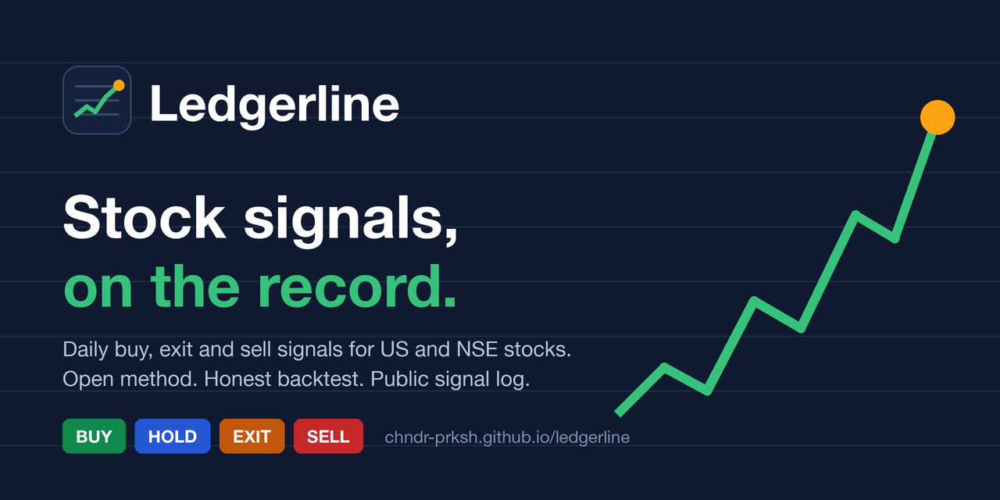
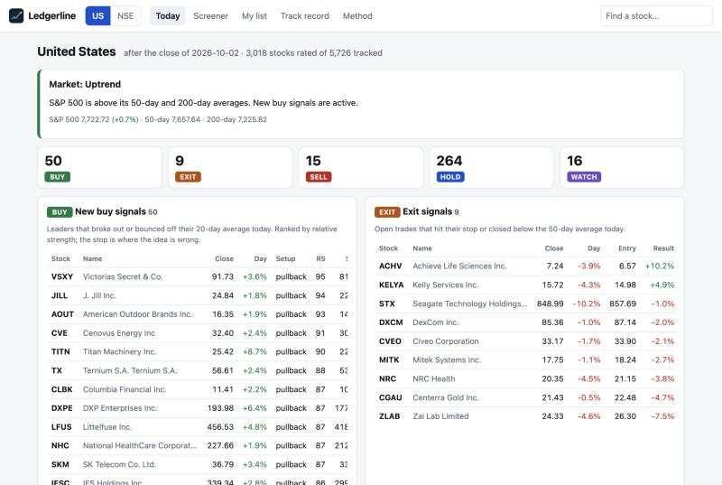

<p align="center"><a href="https://chndr-prksh.github.io/ledgerline/"></a></p>

# Ledgerline

Daily, rule-based **buy / hold / exit / sell** signals for every liquid stock on the US exchanges and
India's NSE, published as a static website and updated by GitHub Actions. No server, no API keys, no
paid data.

**Live site: https://chndr-prksh.github.io/ledgerline/**

[](https://github.com/chndr-prksh/ledgerline/actions/workflows/daily.yml)
[](https://github.com/chndr-prksh/ledgerline/actions/workflows/ci.yml)

Built with Python (pandas, NumPy, PyArrow), vanilla JavaScript and Canvas, GitHub Actions and GitHub Pages.



> For research and education. Not investment advice. The backtest on the site shows where these
> rules have lost to the index as plainly as where they have won.

## What you get

| Page | What it answers |
| --- | --- |
| **Today** | Is the market in an uptrend? Which stocks fired a buy, exit or sell signal on the last close? How broad is the move, and which sectors lead? |
| **Screener** | Every tracked stock with its signal, relative-strength rank and trend score. Filter, sort, or use a preset (new buys, leaders, near breakout, new highs, volume surge). |
| **Stock page** | Candlestick chart with the 50/200-day averages, the system's past entries and exits, the active stop, and the eight trend checks that explain the rating. |
| **My list** | Your own watchlist or holdings, kept in your browser. Flags any of your stocks that triggered an exit or sell today. Export/import as JSON. |
| **Track record** | Backtest per trade and as a 20-position portfolio, against the index, plus the live signal log. |
| **Method** | The exact rules and data sources for the market you are viewing. |

Coverage on 2 Oct 2026: 5,726 US stocks tracked (3,018 rated) and 2,584 NSE stocks tracked (1,177
rated). A stock is *rated* once it has a year of history and clears a price and liquidity floor;
the rest are listed but carry no signal.

## The signals

1. **Relative strength (1–99).** Return over 3, 6, 9 and 12 months, latest quarter counted twice,
   ranked against every other rated stock in the same market.
2. **Eight trend checks.** Price above the 50/150/200-day averages, the averages stacked in order,
   the 200-day rising, price at least 25% off the 52-week low and within 25% of the high, RS ≥ 70.
3. **Market gate.** The benchmark (S&P 500, Nifty 500) against its own 50- and 200-day averages
   gives uptrend / caution / downtrend. New buys pause in a downtrend.
4. **BUY** when all eight checks pass, the stock's average daily range is under 6% of its price,
   and it either closes above its prior 50-day high on
   1.5× average volume (*breakout*) or tags its 20-day average and closes above the previous day's
   high (*pullback*).
5. **EXIT** when price trades at the stop (entry − 2.5 × ATR) or closes below the 50-day average.
6. **SELL** marks the day a stock drops into a downtrend; **AVOID** means it is still in one;
   **WATCH** is a leader within 5% of its breakout level; **HOLD** is an open system trade.

Signals fire on a day's close. The replay assumes entries and trend exits fill at the next open
and stops fill intraday at the stop (or the open, if it gaps through). All numbers live in
[`tracker/config.py`](tracker/config.py).

### How the rules have done

Backtest over about four years of history, after assumed costs, on stocks listed today:

| | Trades | Winners | Avg trade | Index, same days | 20-position portfolio, per year | Index, per year |
| --- | --- | --- | --- | --- | --- | --- |
| NSE (vs Nifty 500) | 6,399 | 27% | +1.58% | +0.90% | +14.5% | +10.2% |
| US (vs S&P 500) | 17,711 | 27% | +0.23% | +1.05% | +7.1% | +19.6% |

So: ahead of the index on NSE (mostly thanks to 2023), well behind it in the US, where a handful
of mega-caps drove the index and broad breakout-buying did not keep up.

Two caveats matter more than the numbers. The universe is today's listings, so failed and delisted
companies are missing (survivorship bias) and results are flattered. And two choices were made
after looking at this same history: the exit style (a close below the 50-day average, out of three
tried) and skipping stocks whose daily range exceeds 6% of price. The site reports results per
market, per setup and per year rather than hiding the bad ones.

The answer to "does it work from here on" is the **live log**: every signal is appended to
`ledger/<market>.csv` on the [`ledger` branch](../../tree/ledger) and committed the day it fires.
Git history shows when each line was written, so the record cannot be rewritten afterwards.

## Data sources

All free and keyless. Each market has a primary and a fallback, and the run refuses to publish a
market whose data looks stale or thin (the previous day's pages stay up instead).

| Need | US | NSE |
| --- | --- | --- |
| Stock list, sector | [Nasdaq screener API](https://api.nasdaq.com/api/screener/stocks?tableonly=true&download=true): every NASDAQ/NYSE/AMEX stock with sector, industry, market cap. Warrants, units, rights and preferreds are filtered out. | NSE [`EQUITY_L.csv`](https://nsearchives.nseindia.com/content/equities/EQUITY_L.csv) (all main-board equities) + Nifty Total Market list for industry. |
| Daily prices | Yahoo Finance chart API: split-adjusted, 5 years in one request per symbol (about a minute for 5,700 symbols). | NSE's official daily zip (`PRddmmyy.zip` on nsearchives): whole market in one file, with index closes, market caps and the corporate-action calendar. Five years backfill in about two minutes, then one file per day. |
| Fallback prices | Nasdaq historical API (per symbol, about 3 requests/s). | Yahoo Finance (`.NS` symbols). |
| Market cap | Nasdaq screener; the ~370 it leaves blank (closed-end funds, some share classes) are filled from Yahoo's quote API. | NSE's daily market-cap file (same zip), every listed company. |
| Benchmark | S&P 500 (Yahoo `^GSPC`) | Nifty 500 (same NSE zip) |
| Split/bonus adjustment | Done by the source. | Derived here from NSE's corporate-action file (`BONUS a:b`, `FVSPLT FRM x TO y`), applied only if the opening price actually moved that way; unexplained gaps beyond the ±20% price band (demergers) are rescaled too. |
| Audit | – | [NSE's MCP server](https://mcp.nseindia.in/bhavcopy/cm/mcp) `get_corporate_actions`, for stocks with a fresh signal. |

Things learned while wiring these up:

- **NSE's MCP server** (launched 2026, no key) is built for assistants, not bulk download: history
  comes three months per call and is unadjusted, and the gateway blocked this project's IP after
  about 500 quick calls. It is used here only as a small, sequential cross-check (at most 40
  stocks per run). In a one-off audit of the full Nifty 500 over five years, the adjustment factors
  derived here matched NSE's in every case that fell inside the stored history.
- **Yahoo** silently misses some Indian corporate actions (for example Trent's 1:2 bonus in June
  2026 is flagged but not applied to history), which is why NSE prices come from NSE.
- **Yahoo and NSE reject default HTTP user agents**; a browser user agent is required.
- **Stooq** now sits behind a JavaScript challenge and **Alpha Vantage / Polygon / Tiingo** need
  keys with tight free quotas, so none are used.
- Not adjusted for: dividends (by design, so levels match charts) and small demergers (for example
  ITC Hotels, about 4%).

## Ideas borrowed from other products

| From | Borrowed |
| --- | --- |
| [TradingView technical ratings](https://www.tradingview.com/script/Jdw7wW2g-Technical-Ratings/) | One headline rating per stock, with every component visible underneath. |
| Investor's Business Daily / MarketSmith | 1–99 relative-strength rank ([weighted quarters](https://shibui.finance/rs-rating-screener)) and a market-direction gate. |
| Mark Minervini's [trend template](https://www.chartmill.com/documentation/stock-screener/technical-analysis-trading-strategies/496-Mark-Minervini-Trend-Template-A-Step-by-Step-Guide-for-Beginners) | The eight trend checks. |
| Finviz, StockCharts | Breadth (% above 50/200-day), sector table, one-click preset scans. |
| Chartink, [PKScreener](https://github.com/pkjmesra/PKScreener) | Breakout / consolidation scans across all of NSE, run on a schedule from GitHub. |
| Trendlyne, Tickertape | A single score next to the signal, and a watchlist that raises alerts. |
| None of them | A public, append-only signal log and a backtest that shows its losing years. |

## Run it yourself

```bash
python3 -m venv .venv && .venv/bin/pip install -r requirements.txt pytest
.venv/bin/python -m pytest -q
.venv/bin/python -m tracker.run --market nse --market us --out public --ledger ledger
cp site/* public/ && python3 -m http.server --directory public 8000
```

The first NSE run downloads five years of daily files into `.cache/` (about two minutes); later
runs fetch one file. Add `--limit 300` for a quick run on the most liquid names.

```
tracker/
  config.py          every threshold, per market
  sources/           nasdaq.py  yahoo.py  nse.py (archive + adjustment)  nse_mcp.py (audit)
  data.py            load a market with fallbacks
  engine.py          indicators, ratings, entry triggers, trade replay
  stats.py           per-trade statistics and the portfolio simulation
  ledger.py          append-only signal log
  publish.py         JSON for the site
  run.py             the daily job
site/                static front end (no build step, no dependencies)
tests/               engine mechanics, no-lookahead, adjustment, ledger
legacy/              the original XGBoost scoring scripts (need private data; kept for reference)
```

## Deploy

1. Repository **Settings → Pages → Source: GitHub Actions**.
2. Run the **Daily signals** workflow once from the Actions tab (or wait for the schedule:
   13:30 UTC for NSE and 22:30 UTC for the US, Monday to Friday).

Each run recomputes both markets (about two minutes), pushes new lines to the `ledger` branch and
deploys the site.

## Limits

- End-of-day only. Nothing updates during market hours.
- Price and volume only: no earnings, valuation or news.
- Free data can be late or wrong. A bad print can create or suppress a signal.
- NSE industry labels exist only for the ~750 Nifty Total Market names; the rest show as Unclassified.
- The original repo's XGBoost model is not part of this system. Its trained model and data were
  never in the repository, so it could not be reproduced.
